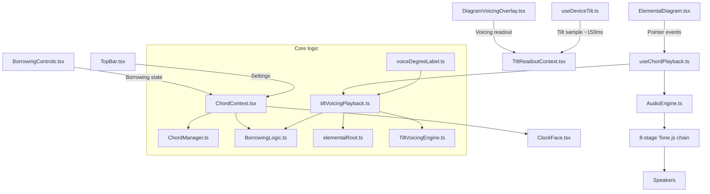

# Movemental

Movemental is an interactive audio application built on React, TypeScript, and Vite.

---

## Repository layout

| Directory | Role |
|-----------|------|
| Repository root | **Active product** (React, TypeScript, Vite, Tone.js). Deploy output: `dist` (Firebase Hosting). |
| [`python-prototype/`](python-prototype/) | **Archived prototype** (CreativePython / PySide desktop app kept for reference). |

The legacy desktop app lives under `python-prototype/`. See [`python-prototype/README.md`](python-prototype/README.md) for setup if you need to run it locally.

---

## Architectural & Data Flow Overview

The web application is structured around a unidirectional state flow, managed by a central React Context (`ChordContext`) and driven by user events from highly responsive SVG graphics.



### ChordContext React Core (`ChordContext.tsx`)
At the core of the UI is the `ChordProvider`, which wires together borrowing
memory, playback, and audio FX settings. High-frequency tilt samples live in
`TiltReadoutContext` so diagram borrowing controls do not re-render on every
sensor update.

**Global parameters**
*   **Tonal center** (default: Bb, offset `10`)
*   **Octave range** (default `3`)
*   **Static voicing level** and **position** (desktop TopBar and phone overlay when not in tilt mode): nine roll widths from Unison through Double Octave, plus bass position Root / 3rd / 5th / 6th or 7th

**Borrowing state**
*   `circlePositions` (`line`, `up`, `down`), `borrowingDirections` (`up`, `down`, `null`), and `noteStates` (`on`, `off`) for four voices
*   **Memory modes**: `global` (one borrowing state across chords) or `per-chord` (saved per chord name)

**Play styles** (see next section)
*   `click_and_hold`, `drone`, and `tilt` (phone)

---

## Play Styles and Voicing

Playback lives in [`useChordPlayback.ts`](src/hooks/useChordPlayback.ts). All styles share the same pipeline: resolve elemental roots, build a borrowed pitch structure, run the tilt voicing engine, then dispatch to `AudioEngine`.

| Style | Trigger | Audio behavior |
|-------|---------|----------------|
| `click_and_hold` | Diagram pointer down/up | Pointer: sustained notes until release. Borrowing sliders: timed half-note preview via `playNotes`. |
| `drone` | Diagram tap or glissando | Legato diff: common tones sustain, others crossfade (`triggerAttack`). |
| `tilt` | Diagram tap (phone) | Samples **raw** device tilt at tap time, re-attacks full voicing. Voicing does not update continuously while holding (tap-time sampling only). |

**Static vs tilt voicing anchors** ([`TiltVoicingEngine.ts`](src/music/TiltVoicingEngine.ts))
*   **Tilt mode (`contrary`)**: Roll narrows the voicing symmetrically around the parallel pivot. Bass can shift as width changes (e.g. flat + Drop 3 may put the 3rd in the bass).
*   **Static controls (`pivot`)**: Position sets the bottom note; voicing width only adds tones above. Changing voicing does not move the bass.

**IN THE BASS readout** ([`voiceDegreeLabel.ts`](src/music/voiceDegreeLabel.ts)): In tilt mode, the label reflects the **lowest sounded pitch**, using the same voicing path as playback. Static position dropdowns still name the parallel pivot (Root, 3rd, 5th, 6th/7th).

---

## Tilt Voicing Engine

Port of the "Movements, Not Chords" counterpoint mechanic. The engine voices each chord on a **tone cycle**: post-borrowing pitch classes as semitone offsets from the root. One ladder step equals one chord tone.

**Roll (phone flat to vertical)**: Nine levels, reversed from the Python prototype. Flat = widest (Double Octave, thinned to five voices). Vertical = unison on the pivot.

**Pitch (chest-ward / away-from-chest)**: Cycles parallel positions on the ladder. Static UI encodes chest-ward positions 1st through 4th only; full tilt on device also supports away-from-chest registers.

**Voicing level names**: Unison, Third, Triad, Close, Octave, Drop 2, Drop 3, Drop 2 and 4, Double Octave.

**Elemental chords** ([`elementalRoot.ts`](src/music/elementalRoot.ts)): Earth, Wind, and Fire use diminished spellings with **contrary-motion anchoring**. The played root and register depend on the previously sounded chord (e.g. Fire after Branch roots a semitone below Branch's pivot). The playback hook stores the last **resolved** chord so chains stay coherent.

Key modules:
*   [`TiltVoicingEngine.ts`](src/music/TiltVoicingEngine.ts): tone cycle, ladder math, thinning rules, contrary vs pivot anchors
*   [`tiltVoicingPlayback.ts`](src/music/tiltVoicingPlayback.ts): borrowing + elemental resolution + engine (shared by audio and labels)
*   [`voicingCache.ts`](src/music/voicingCache.ts): single-entry memo for tilt label readouts (~7 Hz)
*   [`useDeviceTilt.ts`](src/hooks/useDeviceTilt.ts): `deviceorientation` mapping; smoothed sample for UI, raw sample for playback

---

## Symmetrical Geometry & Chord Dictionary

The pitch universe of Movemental is structured around a downward-pointing triangle, separating the chromatic octave into three mutually exclusive symmetrical sets.

```
       [Earth: top-left] ─────── [Wind: top-right]
               \                     /
                \                   /
                 \                 /
                  \               /
                   [Fire: bottom]
```

### The Three Symmetrical Roots
The three primary vertices correspond to the three **Symmetrical Diminished 7th Chords**:
*   **Earth** (C, Eb, F#, A): $[C_4, E\flat_4, F\sharp_4, A_4]$
*   **Wind** (Db, E, G, Bb): $[D\flat_4, E_4, G_4, B\flat_4]$
*   **Fire** (D, F, Ab, B): $[D_4, F_4, A\flat_4, B_4]$

### Coordinates and Quadrant Groups
Along the edges of the Earth-Wind-Fire triangle are **12 quadrant groups** (each representing a cluster of 4 chord variations). They are mathematically calculated along vector coordinates inside `ChordManager.ts`:
1.  **Earth-Wind Axis**: `Trunk`, `Branch`, `Sand-Storm`, `Leaf`
2.  **Wind-Fire Axis**: `Smoke`, `Ember`, `Fire-Storm`, `Flame`
3.  **Fire-Earth Axis**: `Magma`, `Glass`, `Forest-Fire`, `Charcoal`

#### The 4 Symmetrical Slice Variants (The Diamond Clusters)
Every group is a micro-diamond of **4 chord variations**, positioned via normal and tangent vector offsets relative to the main axis:
*   **Base** (Center-outward slice): The foundational voicing.
*   **Sister** (Clockwise-shifted slice): Lighter, higher-frequency extension.
*   **Twin** (Center-inward slice): Dense, close voice-leading.
*   **Brother** (Counter-clockwise-shifted slice): Deeper, low-frequency foundation.

> [!NOTE]
> By rendering coordinates symmetrically on an SVG grid, the `ElementalDiagram` maps cursor position to complex mathematical vectors, allowing fluid, continuous micro-tonal exploration.

---

## The Advanced Voice Borrowing System

The voice borrowing system is a unique harmonic mutation algorithm. Instead of transposing notes within a key, voices "borrow" pitches from the **opposite element** (the vertex opposite to the chord's active axis).

```
Axis: Earth <───> Wind  ========> Borrow from: Fire
Axis: Wind  <───> Fire  ========> Borrow from: Earth
Axis: Fire  <───> Earth ========> Borrow from: Wind
```

### The 4 Voices and Position Mapping
The 4 voice channels are mapped to chord tones via **Root Position Index** (`rootPositionIndex`), which rotates with inversion:
*   **Line 1**: Root ($index = rootIdx$)
*   **Line 2**: 3rd ($index = (rootIdx + 1) \bmod 4$)
*   **Line 3**: 5th ($index = (rootIdx + 2) \bmod 4$)
*   **Line 4**: 6th or 7th ($index = (rootIdx + 3) \bmod 4$)
    *   6th chords: Trunk, Smoke, Magma, Branch, Ember, Glass, and related variants
    *   7th chords: Sand-Storm, Fire-Storm, Forest-Fire, Leaf, Flame, Charcoal, and related variants

UI labels use **IN THE BASS** (Root, 3rd, 5th, 6th/7th) instead of ordinal inversion names.

### Symmetrical Shift Calculation (`BorrowingLogic.ts`)
When a user shifts a voice `up` or `down`, the algorithm replaces that note's pitch class with the closest matching pitch class from the opposite element:

*   **`findNextHigherNote`**: Takes the voice's current pitch class ($PC_0$) and finds the smallest pitch class ($PC_{opp}$) from the opposite diminished chord where $PC_{opp} > PC_0$. It transposes $PC_{opp}$ into the voice's active octave. If no higher pitch class exists, it wraps around to the lowest pitch class of the opposite chord in the next higher octave ($octave + 1$).
*   **`findNextLowerNote`**: Finds the largest pitch class ($PC_{opp}$) from the opposite diminished chord where $PC_{opp} < PC_0$. It transposes $PC_{opp}$ to the active octave. If no lower pitch class exists, it wraps around to the highest pitch class of the opposite chord in the next lower octave ($octave - 1$).

```
Example: Trunk (Earth-Wind axis chord; Root = C4 [60])
Voice 1 (Root = C4) is shifted "up".
Opposite Element: Fire (D4 [62], F4 [65], Ab4 [68], B4 [71])
Next higher pitch class relative to C (0) in Fire is D (2).
Resulting pitch: D4 (62) is borrowed into the chord.
```

### From borrowing to sounded voicing
After borrowing, [`BorrowingLogic.prepareVoicingInput`](src/music/BorrowingLogic.ts) builds a four-slot pitch structure and a mute set in one pass. [`tiltVoicingPlayback.computeTiltVoicedPitches`](src/music/tiltVoicingPlayback.ts) feeds that structure into the tilt ladder, then filters muted pitch classes from the result.

Muted voices are removed **by pitch class**. If borrowing collapsed two lines to the same pitch class, muting one line can remove every voiced note with that class.

**Legacy note**: `ChordManager.applyVoicing` (Close, Drop 2, Drop 3, Drop 2 and 4) remains for older pitch-structure helpers and tests. **Live playback uses the tilt voicing engine**, not drop templates.

### Traditional names and spelling
Each chord carries a `traditionalName` (e.g. `Bb maj6`, slash equivalents for maj6/min6 pairs) and a `quality` string used for display. [`chordSpelling.ts`](src/music/chordSpelling.ts) spells played notes with tertian theory where possible; [`formatPlayingNotes.ts`](src/music/formatPlayingNotes.ts) formats the clock-face readout.

---

## Dynamic Chord Chemistry (`ClockFace.tsx`)

The circular `ClockFace` component acts as a high-fidelity visualizer for active pitches, and calculates a dynamic **chemistry formula** representing the active elemental weight of the sound.

> [!TIP]
> Relative Pitch Classes ($RPC$) are evaluated against the active tonal center offset:
> $$RPC = (\text{pitch} \bmod 12 - \text{tonalCenter} + 12) \bmod 12$$
> Every pitch class falls into one of three elemental buckets depending on $RPC \bmod 3$:
> *   $0$ ➔ **Earth**
> *   $1$ ➔ **Wind**
> *   $2$ ➔ **Fire**

The system counts these occurrences and displays them as a chemical formula:
$$\text{Earth}_x \text{Wind}_y \text{Fire}_z \quad (\text{e.g., } \mathbf{Earth_2 Wind_1 Fire_1})$$

---

## Tone.js Audio Engine & DSP Signal Chain

The application's synthesizer features an optimized DSP signal chain with selectable **playback EQ** (Small Speakers / Large Speakers / Flat) and **instrument presets** (Warm Pad, Super Saw, Electric Cello).

```mermaid
graph LR
    Synth[1. PolySynth] --> Filter[2. Lowpass Filter]
    Filter --> Harmonic[2b. Harmonic Enhance optional]
    Harmonic --> Chorus[3. Chorus]
    Chorus --> Delay[4. Ping-Pong Delay]
    Delay --> Reverb[5. Reverb]
    Reverb --> EQ3[6. EQ3 Playback EQ]
    EQ3 --> Compressor[7. Compressor]
    Compressor --> Makeup[7a. Master Makeup]
    Makeup --> Limiter[8. Limiter]
    Limiter --> Output[Destination]
```



### Playback EQ (Settings → Sound Design)

| Mode | Default platform | EQ | Harmonic Enhance | Loudness | Use case |
|------|------------------|-----|------------------|----------|----------|
| **Large Speakers** | (opt-in) | +2 dB low @ 100 Hz, +1 dB mid, -1.5 dB high | OFF | Synth -7 dB, makeup +4 dB, limiter -1 dBTP | Monitors, subwoofers, car stereos, PA |
| **Small Speakers** | All platforms | -6 dB low @ 180 Hz, +3 dB mid, -2.5 dB high | ON: HPF 180 Hz → light distortion, 20% wet | Platform-adapted (see below) | Phones, laptops, built-in speakers |
| **Flat** | (opt-in) | 0/0/0 dB reference | OFF | Synth -9 dB, makeup +2 dB, limiter -1 dBTP | Exports, calibration, A/B reference |

**Platform defaults:** first visit opens in **Small Speakers** on all platforms. EQ and instrument preset choices are session-only (not persisted to localStorage).

**Small Speakers platform adaptation:** the stored mode stays `smallSpeakers`, but effective DSP values differ by layout tier:

| Parameter | Phone / tablet | Desktop (manual Small Speakers) |
|-----------|----------------|----------------------------------|
| Synth level | -4 dB | -7 dB |
| Master makeup | +6 dB | +2 dB |
| Harmonic wet / distortion | 0.2 / 0.15 | 0.08 / 0.08 |
| Mid EQ | +3 dB | +2 dB |
| FX scale | 0.8 | 0.85 |
| Compressor threshold | -26 dB | -22 dB |

Mobile adaptation targets louder perceived level on phone speakers; desktop adaptation reduces harmonic distortion and makeup so full-range monitors do not clip. Large Speakers and Flat are identical on all platforms.

The harmonic enhance path uses a parallel high-passed distortion branch to generate upper harmonics in the 150–500 Hz range, helping low bass notes remain perceptible on devices that cannot reproduce sub-bass (missing-fundamental psychoacoustics).

### Loudness and gain staging

Perceived volume on phones is optimized through standard mastering practice, not by disabling the limiter:

1. **Source level** — Synth voices use a Small Speakers reference level with per-preset matching so FM/AM timbres are not quieter than pads. Mobile adaptation runs hotter (-4 dB); desktop Small Speakers runs cooler (-7 dB).
2. **FX balance** — Small Speakers scales chorus/reverb wet by platform (`0.8` mobile, `0.85` desktop) so more energy stays in the direct signal.
3. **Bus compression** — Lower threshold with soft knee glues polyphonic chords (target 2–4 dB gain reduction on attacks). Mobile uses -26 dB; desktop Small Speakers uses -22 dB.
4. **Master makeup gain** — Post-compressor `Tone.Gain` restores level (+6 dB mobile Small Speakers, +4 dB Large Speakers, +2 dB Flat and desktop Small Speakers).
5. **Limiter** — Ceiling at -1.0 dBTP (EBU R128 / streaming-safe) catches peaks without brick-wall distortion.

In development builds, post-makeup peak levels log to the console when notes play.

Offline gain-staging and preset loudness tests: [`docs/gain-staging-tests.md`](docs/gain-staging-tests.md).

### Instrument Presets

Presets are defined in [`src/audio/synthPresets.ts`](src/audio/synthPresets.ts). Community JSON starting points are vendored from [Tonejs/Presets](https://github.com/Tonejs/Presets) (see [`PRESET_ATTRIBUTION.md`](src/audio/PRESET_ATTRIBUTION.md)). Vendored presets use their JSON voice parameters (oscillator, FM/AM settings, modulation envelopes) with app-tuned ADSR for chord playback. On preset switch, **Warm Pad** keeps default chorus/reverb; other presets start with bus FX dry.

| Preset | Synth class | Character |
|--------|-------------|-----------|
| Warm Pad | `Synth` | Default fatsawtooth ambient pad |
| Super Saw | `Synth` | Brighter detuned saw |
| Electric Cello | `FMSynth` | Warm FM pad |

FM presets use max polyphony of 8; `Synth` presets use 12.

### 1. Synthesizer Core (`PolySynth`)
*   **Architecture**: PolySynth wrapping `Tone.Synth`, `FMSynth`, `AMSynth`, or `MonoSynth` depending on the selected preset.
*   **Default (Warm Pad)**: `fatsawtooth` with `3` detuned oscillators per voice, 15 cent spread.
*   **Polyphony**: 12 voices for `Synth`, 8 for heavier synth classes.

### 2. Master Lowpass Filter
*   **Configuration**: `Tone.Filter` lowpass, `-12dB/octave` rolloff.
*   **Cutoff**: Per-preset (default `900Hz` for Warm Pad).

### 2b. Harmonic Enhance (Small Speakers only)
*   **Configuration**: Parallel path: highpass @ 180 Hz → `Tone.Distortion` (0.15) → 20% wet blend before chorus.
*   **Purpose**: Adds midrange harmonics so low chord roots translate on phone/laptop speakers.

### 3. Stereo Chorus
*   **Configuration**: LFO `1.5Hz`, `3.5ms` delay, depth `0.7`, default `0.35` wet mix (user controllable).

### 4. Ping-Pong Delay
*   **Configuration**: Dotted quarter (`"4n."`), feedback `0.25`, default dry (user controllable).

### 5. Reverb
*   **Configuration**: `3.5s` decay, `0.02s` pre-delay, `0.30` default wet mix (user controllable).

### 6. EQ3 (Playback EQ)
*   **Small Speakers**: Low cut, mid boost, high tame (see table above). Mid boost is +3 dB on phone/tablet, +2 dB when Small Speakers is selected on desktop.
*   **Large Speakers**: Low/mid weight, high tame for full-range systems (see table above).
*   **Flat**: Neutral 0/0/0 reference curve.

### 7. Compressor
*   **Small Speakers**: Threshold `-26dB` mobile / `-22dB` desktop, ratio `3:1`, knee `6dB`.
*   **Large Speakers**: Threshold `-22dB`, ratio `2.8:1`, knee `5dB`.
*   **Flat**: Threshold `-20dB`, ratio `2.5:1`, knee `4dB`.

### 7a. Master Makeup Gain
*   **Small Speakers**: `+6dB` mobile / `+2dB` desktop post-compression restore.
*   **Large Speakers**: `+4dB` post-compression restore.
*   **Flat**: `+2dB` post-compression restore.

### 8. Limiter
*   **Configuration**: Ceiling `-1.0dBTP` on all EQ modes.

---

## Shared modules

Cross-file utilities introduced in the second-pass refactor. See
[`CONTRIBUTING.md`](CONTRIBUTING.md) for conventions and hot-path rules.

| Module | Purpose |
|--------|---------|
| [`pitchClass.ts`](src/music/pitchClass.ts) | Pitch-class math (`normalizePitchClass`, tonal-center relatives, chord root) |
| [`elementTokens.ts`](src/music/elementTokens.ts) | Parent-element CSS colors and mod-3 styling helpers |
| [`diagramLayout.ts`](src/music/diagramLayout.ts) | SVG viewBox constants and `coordToPixels` |
| [`playbackTiltResolution.ts`](src/music/playbackTiltResolution.ts) | Smooth/smoothest tilt rules shared by playback and bass labels |
| [`utils/clamp.ts`](src/utils/clamp.ts) | Numeric clamp |
| [`TiltReadoutContext.tsx`](src/context/TiltReadoutContext.tsx) | Isolates ~7 Hz tilt updates from `ChordContext` |
| [`voicingCache.ts`](src/music/voicingCache.ts) | Selective invalidation for tilt label memo |

Imports may use the `@/` path alias (`@/music/...`, `@/context/...`) in new
and recently touched modules.

---

## Source layout

| Area | Path | Role |
|------|------|------|
| UI | `src/components/` | Diagram, clock, borrowing controls, TopBar, voicing overlay |
| State | `src/context/ChordContext.tsx`, `TiltReadoutContext.tsx` | Provider wiring |
| Playback | `src/hooks/useChordPlayback.ts` | Play styles, voicing dispatch, elemental chain |
| Tilt sensor | `src/hooks/useDeviceTilt.ts` | Orientation to normalized tilt sample |
| Voicing | `src/music/TiltVoicingEngine.ts`, `tiltVoicingPlayback.ts` | Ladder counterpoint |
| Harmony | `src/music/BorrowingLogic.ts`, `ChordManager.ts`, `elementalRoot.ts` | Borrowing, dictionary, elemental roots |
| Labels | `src/music/voiceDegreeLabel.ts` | IN THE BASS degree readouts |
| Audio | `src/audio/AudioEngine.ts` | Tone.js synth and FX chain |
| Tests | `src/test/`, `src/music/*.test.ts` | Vitest unit and component tests |

---

## Developer Setup & Verification

Follow these instructions to set up, build, and run the project locally.

### Prerequisites
*   [Node.js](https://nodejs.org/) (v18.0.0 or higher recommended)
*   `npm` (v9.0.0 or higher)

### Installation
From the repository root, run:
```bash
npm install
```

### Local Development
Start the local Vite development server with Hot Module Replacement (HMR):
```bash
npm run dev
```
Open [http://localhost:5173](http://localhost:5173) in your browser.

### Static Code Analysis (Linting)
Run ESLint to verify code quality and style compliance:
```bash
npm run lint
```

### Unit tests
Run the Vitest suite (voicing engine, borrowing, playback helpers, components):
```bash
npm test              # unit project (mocked Tone)
npm run test:audio    # offline bus renders (Playwright); see docs/gain-staging-tests.md
```

### Production Build
Type-check the project and compile optimized production assets:
```bash
npm run build
```
Highly optimized, minified assets will be generated in the `dist` directory.

On local machines (not CI), `postbuild` deploys `dist/` to Firebase Hosting (`movemental-dev`). CI builds skip deploy.

### Deploy (Firebase Hosting)

| Environment | Project | How it deploys |
|-------------|---------|----------------|
| Dev | `movemental-dev` | `npm run build` locally (build + deploy; skipped when `CI=true`) |
| Dev preview | `movemental-dev` | Open a PR (GitHub Actions deploys channel `pr-<number>`) |
| Prod | `movemental-chords` | Push to `main` (GitHub Actions after verify) |

**Local (dev):** Run `firebase login` once at the repository root, then `npm run build` deploys to dev.

**PR previews:** Open a pull request. After CI verify passes, GitHub Actions deploys `dist/` to Firebase Hosting preview channel `pr-<number>` on `movemental-dev` and comments the preview URL on the PR. Requires the `FIREBASE_TOKEN` repository secret with Hosting deploy access on `movemental-dev`.

**CI (prod):** Add a repository secret `FIREBASE_TOKEN` from `npx firebase login:ci` (account needs Hosting deploy access on both projects).

### Preview Production Build
Serve the compiled production files locally to test performance:
```bash
npm run preview
```

### Verification Utility Script
The codebase includes a CLI utility `src/check.ts` that initializes the chord dictionary and prints symmetrical coordinates, vector centers, and pitch arrays to the console. You can run this directly in your terminal using a runner like `vite-node` or `ts-node` to verify mathematical alignment:
```bash
npx vite-node src/check.ts
```

## Contributing

See [`CONTRIBUTING.md`](CONTRIBUTING.md) for conventions and module layout.
This project follows a [Code of Conduct](CODE_OF_CONDUCT.md). To report a
security vulnerability, see [`SECURITY.md`](SECURITY.md) instead of opening a
public issue.
