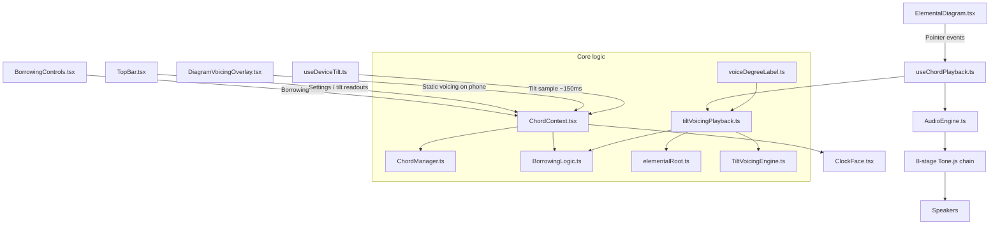

# Movemental Web: The Elemental Tesseract Audio Engine & Interactive Interface

Movemental Web is a state-of-the-art interactive audio application built on React, TypeScript, and Vite. It implements the **Elemental Tesseract**, a mathematical and music-theoretical system that maps pitch relations to symmetrical coordinates across elemental axes, utilizing an advanced voice borrowing system, a **tilt counterpoint voicing engine** (phone play style), and an 8-stage laptop-optimized DSP signal chain powered by Tone.js.

---

## Architectural & Data Flow Overview

The web application is structured around a unidirectional state flow, managed by a central React Context (`ChordContext`) and driven by user events from highly responsive SVG graphics.



### ChordContext React Core (`ChordContext.tsx`)
At the core of the UI is the `ChordProvider`, which wires together borrowing memory, device tilt, playback, and audio FX settings.

**Global parameters**
*   **Tonal center** (default: Bb, offset `10`)
*   **Octave range** (default `3`)
*   **Static voicing level** and **position** (desktop TopBar and phone overlay when not in tilt mode): nine roll widths from Unison through Double Octave, plus bass position Root / 3rd / 5th / 6th or 7th

**Borrowing state**
*   `circlePositions` (`line`, `up`, `down`), `borrowingDirections` (`up`, `down`, `null`), and `noteStates` (`on`, `off`) for four voices
*   **Memory modes**: `global` (one borrowing state across chords) or `per-chord` (saved per chord name)

**Play styles** (see next section)
*   `click_and_hold`, `drone`, and `tilt` (phone)

---

## Play Styles and Voicing

Playback lives in [`useChordPlayback.ts`](src/hooks/useChordPlayback.ts). All styles share the same pipeline: resolve elemental roots, build a borrowed pitch structure, run the tilt voicing engine, then dispatch to `AudioEngine`.

| Style | Trigger | Audio behavior |
|-------|---------|----------------|
| `click_and_hold` | Diagram pointer down/up | Pointer: sustained notes until release. Borrowing sliders: timed half-note preview via `playNotes`. |
| `drone` | Diagram tap or glissando | Legato diff: common tones sustain, others crossfade (`triggerAttack`). |
| `tilt` | Diagram tap (phone) | Samples **raw** device tilt at tap time, re-attacks full voicing with haptic feedback. Voicing does not update continuously while holding (tap-time sampling only). |

**Static vs tilt voicing anchors** ([`TiltVoicingEngine.ts`](src/music/TiltVoicingEngine.ts))
*   **Tilt mode (`contrary`)**: Roll narrows the voicing symmetrically around the parallel pivot. Bass can shift as width changes (e.g. flat + Drop 3 may put the 3rd in the bass).
*   **Static controls (`pivot`)**: Position sets the bottom note; voicing width only adds tones above. Changing voicing does not move the bass.

**IN THE BASS readout** ([`voiceDegreeLabel.ts`](src/music/voiceDegreeLabel.ts)): In tilt mode, the label reflects the **lowest sounded pitch**, using the same voicing path as playback. Static position dropdowns still name the parallel pivot (Root, 3rd, 5th, 6th/7th).

---

## Tilt Voicing Engine

Port of the "Movements, Not Chords" counterpoint mechanic. The engine voices each chord on a **tone cycle**: post-borrowing pitch classes as semitone offsets from the root. One ladder step equals one chord tone.

**Roll (phone flat to vertical)**: Nine levels, reversed from the Python prototype. Flat = widest (Double Octave, thinned to five voices). Vertical = unison on the pivot.

**Pitch (chest-ward / away-from-chest)**: Cycles parallel positions on the ladder. Static UI encodes chest-ward positions 1st through 4th only; full tilt on device also supports away-from-chest registers.

**Voicing level names**: Unison, Third, Triad, Close, Octave, Drop 2, Drop 3, Drop 2 and 4, Double Octave.

**Elemental chords** ([`elementalRoot.ts`](src/music/elementalRoot.ts)): Earth, Wind, and Fire use diminished spellings with **contrary-motion anchoring**. The played root and register depend on the previously sounded chord (e.g. Fire after Branch roots a semitone below Branch's pivot). The playback hook stores the last **resolved** chord so chains stay coherent.

Key modules:
*   [`TiltVoicingEngine.ts`](src/music/TiltVoicingEngine.ts): tone cycle, ladder math, thinning rules, contrary vs pivot anchors
*   [`tiltVoicingPlayback.ts`](src/music/tiltVoicingPlayback.ts): borrowing + elemental resolution + engine (shared by audio and labels)
*   [`voicingCache.ts`](src/music/voicingCache.ts): single-entry memo for tilt label readouts (~7 Hz)
*   [`useDeviceTilt.ts`](src/hooks/useDeviceTilt.ts): `deviceorientation` mapping; smoothed sample for UI, raw sample for playback and haptics

---

## Symmetrical Geometry & Chord Dictionary

The pitch universe of Movemental is structured around a downward-pointing triangle, separating the chromatic octave into three mutually exclusive symmetrical sets.

```
       [Earth: top-left] ─────── [Wind: top-right]
               \                     /
                \                   /
                 \                 /
                  \               /
                   [Fire: bottom]
```

### The Three Symmetrical Roots
The three primary vertices correspond to the three **Symmetrical Diminished 7th Chords**:
*   **Earth** (C, Eb, F#, A): $[C_4, E\flat_4, F\sharp_4, A_4]$
*   **Wind** (Db, E, G, Bb): $[D\flat_4, E_4, G_4, B\flat_4]$
*   **Fire** (D, F, Ab, B): $[D_4, F_4, A\flat_4, B_4]$

### Coordinates and Quadrant Groups
Along the edges of the Earth-Wind-Fire triangle are **12 quadrant groups** (each representing a cluster of 4 chord variations). They are mathematically calculated along vector coordinates inside `ChordManager.ts`:
1.  **Earth-Wind Axis**: `Trunk`, `Branch`, `Sand-Storm`, `Leaf`
2.  **Wind-Fire Axis**: `Smoke`, `Ember`, `Fire-Storm`, `Flame`
3.  **Fire-Earth Axis**: `Magma`, `Glass`, `Forest-Fire`, `Charcoal`

#### The 4 Symmetrical Slice Variants (The Diamond Clusters)
Every group is a micro-diamond of **4 chord variations**, positioned via normal and tangent vector offsets relative to the main axis:
*   **Base** (Center-outward slice): The foundational voicing.
*   **Sister** (Clockwise-shifted slice): Lighter, higher-frequency extension.
*   **Twin** (Center-inward slice): Dense, close voice-leading.
*   **Brother** (Counter-clockwise-shifted slice): Deeper, low-frequency foundation.

> [!NOTE]
> By rendering coordinates symmetrically on an SVG grid, the `ElementalDiagram` maps cursor position to complex mathematical vectors, allowing fluid, continuous micro-tonal exploration.

---

## The Advanced Voice Borrowing System

The voice borrowing system is a unique harmonic mutation algorithm. Instead of transposing notes within a key, voices "borrow" pitches from the **opposite element** (the vertex opposite to the chord's active axis).

```
Axis: Earth <───> Wind  ========> Borrow from: Fire
Axis: Wind  <───> Fire  ========> Borrow from: Earth
Axis: Fire  <───> Earth ========> Borrow from: Wind
```

### The 4 Voices and Position Mapping
The 4 voice channels are mapped to chord tones via **Root Position Index** (`rootPositionIndex`), which rotates with inversion:
*   **Line 1**: Root ($index = rootIdx$)
*   **Line 2**: 3rd ($index = (rootIdx + 1) \bmod 4$)
*   **Line 3**: 5th ($index = (rootIdx + 2) \bmod 4$)
*   **Line 4**: 6th or 7th ($index = (rootIdx + 3) \bmod 4$)
    *   6th chords: Trunk, Smoke, Magma, Branch, Ember, Glass, and related variants
    *   7th chords: Sand-Storm, Fire-Storm, Forest-Fire, Leaf, Flame, Charcoal, and related variants

UI labels use **IN THE BASS** (Root, 3rd, 5th, 6th/7th) instead of ordinal inversion names.

### Symmetrical Shift Calculation (`BorrowingLogic.ts`)
When a user shifts a voice `up` or `down`, the algorithm replaces that note's pitch class with the closest matching pitch class from the opposite element:

*   **`findNextHigherNote`**: Takes the voice's current pitch class ($PC_0$) and finds the smallest pitch class ($PC_{opp}$) from the opposite diminished chord where $PC_{opp} > PC_0$. It transposes $PC_{opp}$ into the voice's active octave. If no higher pitch class exists, it wraps around to the lowest pitch class of the opposite chord in the next higher octave ($octave + 1$).
*   **`findNextLowerNote`**: Finds the largest pitch class ($PC_{opp}$) from the opposite diminished chord where $PC_{opp} < PC_0$. It transposes $PC_{opp}$ to the active octave. If no lower pitch class exists, it wraps around to the highest pitch class of the opposite chord in the next lower octave ($octave - 1$).

```
Example: Trunk (Earth-Wind axis chord; Root = C4 [60])
Voice 1 (Root = C4) is shifted "up".
Opposite Element: Fire (D4 [62], F4 [65], Ab4 [68], B4 [71])
Next higher pitch class relative to C (0) in Fire is D (2).
Resulting pitch: D4 (62) is borrowed into the chord.
```

### From borrowing to sounded voicing
After borrowing, [`BorrowingLogic.prepareVoicingInput`](src/music/BorrowingLogic.ts) builds a four-slot pitch structure and a mute set in one pass. [`tiltVoicingPlayback.computeTiltVoicedPitches`](src/music/tiltVoicingPlayback.ts) feeds that structure into the tilt ladder, then filters muted pitch classes from the result.

Muted voices are removed **by pitch class**. If borrowing collapsed two lines to the same pitch class, muting one line can remove every voiced note with that class.

**Legacy note**: `ChordManager.applyVoicing` (Close, Drop 2, Drop 3, Drop 2 and 4) remains for older pitch-structure helpers and tests. **Live playback uses the tilt voicing engine**, not drop templates.

### Traditional names and spelling
Each chord carries a `traditionalName` (e.g. `Bb maj6`, slash equivalents for maj6/min6 pairs) and a `quality` string used for display. [`chordSpelling.ts`](src/music/chordSpelling.ts) spells played notes with tertian theory where possible; [`formatPlayingNotes.ts`](src/music/formatPlayingNotes.ts) formats the clock-face readout.

---

## Dynamic Chord Chemistry (`ClockFace.tsx`)

The circular `ClockFace` component acts as a high-fidelity visualizer for active pitches, and calculates a dynamic **chemistry formula** representing the active elemental weight of the sound.

> [!TIP]
> Relative Pitch Classes ($RPC$) are evaluated against the active tonal center offset:
> $$RPC = (\text{pitch} \bmod 12 - \text{tonalCenter} + 12) \bmod 12$$
> Every pitch class falls into one of three elemental buckets depending on $RPC \bmod 3$:
> *   $0$ ➔ **Earth**
> *   $1$ ➔ **Wind**
> *   $2$ ➔ **Fire**

The system counts these occurrences and displays them as a chemical formula:
$$\text{Earth}_x \text{Wind}_y \text{Fire}_z \quad (\text{e.g., } \mathbf{Earth_2 Wind_1 Fire_1})$$

---

## Tone.js Audio Engine & DSP Signal Chain

The application's synthesizer features an optimized **8-stage DSP Signal Chain** configured for high-fidelity stereo width, lush environments, and balanced small-diaphragm performance.

```mermaid
graph LR
    Synth[1. PolySynth <br> fatsawtooth] --> Filter[2. Lowpass Filter <br> @ 900Hz, -12dB/oct]
    Filter --> Chorus[3. Chorus <br> 1.5Hz, 0.7 depth]
    Chorus --> Delay[4. Ping-Pong Delay <br> Dotted 4th, 0.25 feed]
    Delay --> Reverb[5. Reverb <br> 3.5s decay]
    Reverb --> EQ3[6. EQ3 <br> Laptop-Speaker Tune]
    EQ3 --> Compressor[7. Compressor <br> Threshold -16dB]
    Compressor --> Limiter[8. Limiter <br> Limit -1.5dB]
    Limiter --> Output[Destination]
    
    style EQ3 fill:#238636,stroke:#30363d,color:#ffffff
    style Limiter fill:#851414,stroke:#30363d,color:#ffffff
```



### 1. Synthesizer Core (`PolySynth`)
*   **Architecture**: PolySynth wrapping standard `Tone.Synth` (4x CPU gain compared to heavy multi-node synth configurations).
*   **Oscillator**: `fatsawtooth` utilizing `3` detuned oscillators per voice, with a tight detune spread of `15` cents to ensure high-density analog warmth without losing clear harmonic focus.
*   **Polyphony**: Max polyphony of `12` voices, designed for smooth 4-note polyphonic changes and long legato crossfading release overlaps.
*   **ADSR Click-and-Hold Envelope**:
    *   `Attack`: `0.08s` (prevents zero-crossing pops/clicks)
    *   `Decay`: `1.5s`
    *   `Sustain`: `0.6` (sits smoothly in the background)
    *   `Release`: `1.2s` (ambient, trailing legato overlap)
*   **Legato Drone Envelope**:
    *   `Attack`: `3.5s` (luxurious, atmospheric swell)
    *   `Decay`: `2.5s`
    *   `Sustain`: `0.2`
    *   `Release`: `0.2s` (rapid transition release to crossfade into new notes)

### 2. Master Lowpass Filter
*   **Configuration**: `Tone.Filter` set to `lowpass` with a `-12dB/octave` rolloff.
*   **Cutoff Frequency**: `900Hz`.
*   **Purpose**: Softens harsh high-register harmonics to produce rich, warm, ambient pad textures, preventing high-frequency small-speaker buzzing.

### 3. Stereo Chorus
*   **Configuration**: LFO speed of `1.5Hz`, `3.5ms` delay time, LFO depth of `0.7`, and `0.35` default wet mix.
*   **Purpose**: Employs an active stereo LFO to introduce high-end harmonic shimmer and wide stereo panning.

### 4. Ping-Pong Delay
*   **Configuration**: Feedback of `0.25` and rhythmic delay time of `"4n."` (dotted quarter notes), default `0.0` wet mix (user controllable).
*   **Purpose**: Adds bouncy, rhythmically active echo tails that sit off-beat to expand spatial depth.

### 5. Convolution & Algorithmic Reverb
*   **Configuration**: Lush decay time of `3.5s`, `0.02s` pre-delay, and `0.30` default wet mix.
*   **Purpose**: Generates expensive, diffuse spatial textures using asynchronous background impulse response calculation to keep the main application thread fluid.

### 6. Laptop-Speaker Optimized EQ3
*   **Configuration**:
    *   **Low Shelf**: `-6dB` cut at `180Hz`. Prevents small, thin speaker diaphragms (found on laptops, iPads, and phones) from attempting to reproduce muddy bass frequencies, eliminating speaker rattle and harmonic distortion.
    *   **Mid Peaking**: `+2.5dB` presence boost between `180Hz` and `2400Hz`. Accentuates midrange fundamental pitches, delivering warm, audible, and clear chord translation on built-in laptop/mobile speakers.
    *   **High Shelf**: `-2.5dB` smooth high-frequency cut. Tames high-frequency click transients.

### 7. Core Compressor
*   **Configuration**: Threshold: `-16dB`, Ratio: `4.0`, Attack time: `0.03s`, Release time: `0.08s`.
*   **Purpose**: Dynamically glues individual voices together, smoothing transient peaks and enhancing overall clarity.

### 8. Mastering Limiter
*   **Configuration**: Threshold of `-1.5dB`.
*   **Purpose**: Acts as a safety barrier against digital clipping, guaranteeing clear, pristine sound summing under any combination of voicings and shifting.

---

## Source layout

| Area | Path | Role |
|------|------|------|
| UI | `src/components/` | Diagram, clock, borrowing controls, TopBar, voicing overlay |
| State | `src/context/ChordContext.tsx` | Provider wiring |
| Playback | `src/hooks/useChordPlayback.ts` | Play styles, voicing dispatch, elemental chain |
| Tilt sensor | `src/hooks/useDeviceTilt.ts` | Orientation to normalized tilt sample |
| Voicing | `src/music/TiltVoicingEngine.ts`, `tiltVoicingPlayback.ts` | Ladder counterpoint |
| Harmony | `src/music/BorrowingLogic.ts`, `ChordManager.ts`, `elementalRoot.ts` | Borrowing, dictionary, elemental roots |
| Labels | `src/music/voiceDegreeLabel.ts` | IN THE BASS degree readouts |
| Audio | `src/audio/AudioEngine.ts` | Tone.js synth and FX chain |
| Tests | `src/test/`, `src/music/*.test.ts` | Vitest unit and component tests |

---

## Developer Setup & Verification

Follow these instructions to set up, build, and run the project locally.

### Prerequisites
*   [Node.js](https://nodejs.org/) (v18.0.0 or higher recommended)
*   `npm` (v9.0.0 or higher)

### Installation
From the root of the `web` folder, run:
```bash
npm install
```

### Local Development
Start the local Vite development server with Hot Module Replacement (HMR):
```bash
npm run dev
```
Open [http://localhost:5173](http://localhost:5173) in your browser.

### Static Code Analysis (Linting)
Run ESLint to verify code quality and style compliance:
```bash
npm run lint
```

### Unit tests
Run the Vitest suite (voicing engine, borrowing, playback helpers, components):
```bash
npm test
```

### Production Build
Type-check the project and compile optimized production assets:
```bash
npm run build
```
Highly optimized, minified assets will be generated in the `web/dist` directory.

On local machines (not CI), `postbuild` deploys `dist/` to Firebase Hosting (`movemental-dev`). CI builds skip deploy.

### Preview Production Build
Serve the compiled production files locally to test performance:
```bash
npm run preview
```

### Verification Utility Script
The codebase includes a CLI utility `web/src/check.ts` that initializes the chord dictionary and prints symmetrical coordinates, vector centers, and pitch arrays to the console. You can run this directly in your terminal using a runner like `vite-node` or `ts-node` to verify mathematical alignment:
```bash
npx vite-node src/check.ts
```
