# Movemental Web: The Elemental Tesseract Audio Engine & Interactive Interface

Movemental Web is a state-of-the-art interactive audio application built on React, TypeScript, and Vite. It implements the **Elemental Tesseract**—a mathematical and music-theoretical system that maps pitch relations to symmetrical coordinates across elemental axes, utilizing an advanced voice borrowing system and an 8-stage laptop-optimized DSP signal chain powered by Tone.js.

---

## 🗺️ Architectural & Data Flow Overview

The web application is structured around a unidirectional state flow, managed by a central React Context (`ChordContext`) and driven by user events from highly responsive SVG graphics.

```mermaid
graph TD
    %% User Interactions
    UI_Diag[ElementalDiagram.tsx <br> Interactive SVG Map] -->|Pointer Events| Context
    UI_Clock[ClockFace.tsx <br> Symmetrical Pitch Visualizer] -->|Selected Chord Coordinates| Context
    UI_Sliders[BorrowingControls.tsx <br> Voice Sliders & Locks] -->|Shift/Mute/Lock States| Context
    UI_TopBar[TopBar.tsx <br> Global Parameters] -->|Tonal Center, Octave, Voicing, ADSR| Context

    %% Central Context & Managers
    subgraph Core Framework [React State & Core Logic]
        Context[ChordContext.tsx <br> Central State Hub]
        Manager[ChordManager.ts <br> Coordinate & Chord Dictionary]
        Logic[BorrowingLogic.ts <br> Pitch Mutation Algorithm]
    end

    Context <-->|Query Coords / Inversions / Voicings| Manager
    Context <-->|Calculates Altered Pitch Sets| Logic
    Logic <-->|Fetch Opposite Element Dim7 Chord| Manager

    %% Audio Engine & DSP
    subgraph DSP Engine [Audio DSP Chain]
        Engine[AudioEngine.ts <br> Tone.js Orchestrator]
        ToneSynth[PolySynth <br> fatsawtooth]
        DSP[8-Stage DSP Signal Chain]
    end

    Context -->|Pitches & Envelope Parameters| Engine
    Engine -->|Triggers Attack/Release| ToneSynth
    ToneSynth --> DSP
    DSP -->|Laptop-speaker Optimized Stereo Audio| Output[Destination / Speakers]
    
    %% Styling and layout
    style Core Framework fill:#161b22,stroke:#30363d,stroke-width:2px
    style DSP Engine fill:#121820,stroke:#238636,stroke-width:2px
```



### 🧠 ChordContext React Core (`ChordContext.tsx`)
At the core of the UI is the `ChordProvider`, which manages:
*   **Active Configurations**: Tonal Center offset (default: Bb / Offset `10`), Octave Range (default: `3`), and Voicing style (`Close`, `Drop 2`, `Drop 3`, and `Drop 2 & 4`).
*   **Borrowing State Configurations**: Keeps track of `circlePositions` (`line`, `up`, `down`), `borrowingDirections` (`up`, `down`, `null`), and `noteStates` (`on`, `off`) for the 4 voices.
*   **Play/Sustain Modes**:
    *   `adsr` (ADSR Click/Hover Mode): Notes play when clicked/hovered and are instantly released when the pointer is lifted anywhere on the user's OS. A global event listener on `window` bound to `useRef` references guarantees that pointer lifts are successfully captured with zero stale closures.
    *   `infinite` (Infinite Drone Mode): Chords are triggered using sustain (`synth.triggerAttack()`) and ring out indefinitely. When transitioning to a new chord, matching voice pitches are sustained seamlessly, preventing note re-triggering and ensuring a continuous, rich legato drone.
*   **Memory Modes**: Supports both `global` memory (the borrowing state is locked globally as you navigate chords) and `per-chord` memory (saving and restoring unique voice, shift, and lock settings on a chord-by-chord basis).

---

## 📐 Symmetrical Geometry & Chord Dictionary

The pitch universe of Movemental is structured around a downward-pointing triangle, separating the chromatic octave into three mutually exclusive symmetrical sets.

```
       [Earth: top-left] ─────── [Wind: top-right]
               \                     /
                \                   /
                 \                 /
                  \               /
                   [Fire: bottom]
```

### 🧬 The Three Symmetrical Roots
The three primary vertices correspond to the three **Symmetrical Diminished 7th Chords**:
*   🟢 **Earth** (C, Eb, F#, A) — $[C_4, E\flat_4, F\sharp_4, A_4]$
*   🔵 **Wind** (Db, E, G, Bb) — $[D\flat_4, E_4, G_4, B\flat_4]$
*   🔴 **Fire** (D, F, Ab, B) — $[D_4, F_4, A\flat_4, B_4]$

### 💎 Coordinates and Quadrant Groups
Along the edges of the Earth-Wind-Fire triangle are **12 quadrant groups** (each representing a cluster of 4 chord variations). They are mathematically calculated along vector coordinates inside `ChordManager.ts`:
1.  **Earth-Wind Axis**: `Trunk`, `Branch`, `Sand-Storm`, `Leaf`
2.  **Wind-Fire Axis**: `Smoke`, `Ember`, `Fire-Storm`, `Flame`
3.  **Fire-Earth Axis**: `Magma`, `Glass`, `Forest-Fire`, `Charcoal`

#### 🍊 The 4 Symmetrical Slice Variants (The Diamond Clusters)
Every group is a micro-diamond of **4 chord variations**, positioned via normal and tangent vector offsets relative to the main axis:
*   **Base** (Center-outward slice): The foundational voicing.
*   **Sister** (Clockwise-shifted slice): Lighter, higher-frequency extension.
*   **Twin** (Center-inward slice): Dense, close voice-leading.
*   **Brother** (Counter-clockwise-shifted slice): Deeper, low-frequency foundation.

> [!NOTE]
> By rendering coordinates symmetrically on an SVG grid, the `ElementalDiagram` maps cursor position to complex mathematical vectors, allowing fluid, continuous micro-tonal exploration.

---

## 🔄 The Advanced Voice Borrowing System

The voice borrowing system is a unique harmonic mutation algorithm. Instead of transposing notes within a key, voices "borrow" pitches from the **opposite element** (the vertex opposite to the chord's active axis).

```
Axis: Earth <───> Wind  ========> Borrow from: Fire
Axis: Wind  <───> Fire  ========> Borrow from: Earth
Axis: Fire  <───> Earth ========> Borrow from: Wind
```

### 🎼 The 4 Voices & Inversion Mapping
The 4 voice channels of the synthesizer are mapped to the notes of the active chord based on its **Root Position Index** (`rootPositionIndex`), automatically accounting for chord inversions:
*   **Line 1** ➔ **Root** note of the chord ($index = rootIdx$)
*   **Line 2** ➔ **3rd** of the chord ($index = (rootIdx + 1) \bmod 4$)
*   **Line 3** ➔ **5th** of the chord ($index = (rootIdx + 2) \bmod 4$)
*   **Line 4** ➔ **6th/7th** of the chord ($index = (rootIdx + 3) \bmod 4$)
    *   *6th Chords*: Trunk, Smoke, Magma, Branch, Ember, Glass.
    *   *7th Chords*: Sand-Storm, Fire-Storm, Forest-Fire, Leaf, Flame, Charcoal.

### 🧮 Symmetrical Shift Calculation (`BorrowingLogic.ts`)
When a user shifts a voice `up` or `down`, the algorithm replaces that note's pitch class with the closest matching pitch class from the opposite element:

*   **`findNextHigherNote`**: Takes the voice's current pitch class ($PC_0$) and finds the smallest pitch class ($PC_{opp}$) from the opposite diminished chord where $PC_{opp} > PC_0$. It transposes $PC_{opp}$ into the voice's active octave. If no higher pitch class exists, it wraps around to the lowest pitch class of the opposite chord in the next higher octave ($octave + 1$).
*   **`findNextLowerNote`**: Finds the largest pitch class ($PC_{opp}$) from the opposite diminished chord where $PC_{opp} < PC_0$. It transposes $PC_{opp}$ to the active octave. If no lower pitch class exists, it wraps around to the highest pitch class of the opposite chord in the next lower octave ($octave - 1$).

```
Example: Trunk (Earth-Wind axis chord; Root = C4 [60])
Voice 1 (Root = C4) is shifted "up".
Opposite Element: Fire (D4 [62], F4 [65], Ab4 [68], B4 [71])
Next higher pitch class relative to C (0) in Fire is D (2).
Resulting pitch: D4 (62) is borrowed into the chord.
```

### 🧼 Voicing Application
After borrowing modifications are applied, the resulting pitch array is mapped to a voicing template:
*   **Close Voicing**: Notes are kept in their original tightly packed intervals.
*   **Drop 2**: The second highest note is dropped an octave.
*   **Drop 3**: The third highest note is dropped an octave.
*   **Drop 2 & 4**: The second and fourth highest notes are dropped an octave.

---

## 🧪 Dynamic Chord Chemistry (`ClockFace.tsx`)

The circular `ClockFace` component acts as a high-fidelity visualizer for active pitches, and calculates a dynamic **chemistry formula** representing the active elemental weight of the sound.

> [!TIP]
> Relative Pitch Classes ($RPC$) are evaluated against the active tonal center offset:
> $$RPC = (\text{pitch} \bmod 12 - \text{tonalCenter} + 12) \bmod 12$$
> Every pitch class falls into one of three elemental buckets depending on $RPC \bmod 3$:
> *   $0$ ➔ **Earth**
> *   $1$ ➔ **Wind**
> *   $2$ ➔ **Fire**

The system counts these occurrences and displays them as a chemical formula:
$$\text{Earth}_x \text{Wind}_y \text{Fire}_z \quad (\text{e.g., } \mathbf{Earth_2 Wind_1 Fire_1})$$

---

## 🎛️ Tone.js Audio Engine & DSP Signal Chain

The application's synthesizer features an optimized **8-stage DSP Signal Chain** configured for high-fidelity stereo width, lush environments, and balanced small-diaphragm performance.

```mermaid
graph LR
    Synth[1. PolySynth <br> fatsawtooth] --> Filter[2. Lowpass Filter <br> @ 900Hz, -12dB/oct]
    Filter --> Chorus[3. Chorus <br> 1.5Hz, 0.7 depth]
    Chorus --> Delay[4. Ping-Pong Delay <br> Dotted 4th, 0.25 feed]
    Delay --> Reverb[5. Reverb <br> 3.5s decay]
    Reverb --> EQ3[6. EQ3 <br> Laptop-Speaker Tune]
    EQ3 --> Compressor[7. Compressor <br> Threshold -16dB]
    Compressor --> Limiter[8. Limiter <br> Limit -1.5dB]
    Limiter --> Output[Destination]
    
    style EQ3 fill:#238636,stroke:#30363d,color:#ffffff
    style Limiter fill:#851414,stroke:#30363d,color:#ffffff
```



### 1. Synthesizer Core (`PolySynth`)
*   **Architecture**: PolySynth wrapping standard `Tone.Synth` (4x CPU gain compared to heavy multi-node synth configurations).
*   **Oscillator**: `fatsawtooth` utilizing `3` detuned oscillators per voice, with a tight detune spread of `15` cents to ensure high-density analog warmth without losing clear harmonic focus.
*   **Polyphony**: Max polyphony of `12` voices, designed for smooth 4-note polyphonic changes and long legato crossfading release overlaps.
*   **ADSR Click-and-Hold Envelope**:
    *   `Attack`: `0.08s` (prevents zero-crossing pops/clicks)
    *   `Decay`: `1.5s`
    *   `Sustain`: `0.6` (sits smoothly in the background)
    *   `Release`: `1.2s` (ambient, trailing legato overlap)
*   **Legato Drone Envelope**:
    *   `Attack`: `3.5s` (luxurious, atmospheric swell)
    *   `Decay`: `2.5s`
    *   `Sustain`: `0.2`
    *   `Release`: `0.2s` (rapid transition release to crossfade into new notes)

### 2. Master Lowpass Filter
*   **Configuration**: `Tone.Filter` set to `lowpass` with a `-12dB/octave` rolloff.
*   **Cutoff Frequency**: `900Hz`.
*   **Purpose**: Softens harsh high-register harmonics to produce rich, warm, ambient pad textures, preventing high-frequency small-speaker buzzing.

### 3. Stereo Chorus
*   **Configuration**: LFO speed of `1.5Hz`, `3.5ms` delay time, LFO depth of `0.7`, and `0.35` default wet mix.
*   **Purpose**: Employs an active stereo LFO to introduce high-end harmonic shimmer and wide stereo panning.

### 4. Ping-Pong Delay
*   **Configuration**: Feedback of `0.25` and rhythmic delay time of `"4n."` (dotted quarter notes), default `0.0` wet mix (user controllable).
*   **Purpose**: Adds bouncy, rhythmically active echo tails that sit off-beat to expand spatial depth.

### 5. Convolution & Algorithmic Reverb
*   **Configuration**: Lush decay time of `3.5s`, `0.02s` pre-delay, and `0.30` default wet mix.
*   **Purpose**: Generates expensive, diffuse spatial textures using asynchronous background impulse response calculation to keep the main application thread fluid.

### 6. Laptop-Speaker Optimized EQ3
*   **Configuration**:
    *   **Low Shelf**: `-6dB` cut at `180Hz`. Prevents small, thin speaker diaphragms (found on laptops, iPads, and phones) from attempting to reproduce muddy bass frequencies, eliminating speaker rattle and harmonic distortion.
    *   **Mid Peaking**: `+2.5dB` presence boost between `180Hz` and `2400Hz`. Accentuates midrange fundamental pitches, delivering warm, audible, and clear chord translation on built-in laptop/mobile speakers.
    *   **High Shelf**: `-2.5dB` smooth high-frequency cut. Tames high-frequency click transients.

### 7. Core Compressor
*   **Configuration**: Threshold: `-16dB`, Ratio: `4.0`, Attack time: `0.03s`, Release time: `0.08s`.
*   **Purpose**: Dynamically glues individual voices together, smoothing transient peaks and enhancing overall clarity.

### 8. Mastering Limiter
*   **Configuration**: Threshold of `-1.5dB`.
*   **Purpose**: Acts as a safety barrier against digital clipping, guaranteeing clear, pristine sound summing under any combination of voicings and shifting.

---

## 🛠️ Developer Setup & Verification

Follow these instructions to set up, build, and run the project locally.

### 📦 Prerequisites
*   [Node.js](https://nodejs.org/) (v18.0.0 or higher recommended)
*   `npm` (v9.0.0 or higher)

### 🚀 Installation
From the root of the `web` folder, run:
```bash
npm install
```

### 💻 Local Development
Start the local Vite development server with Hot Module Replacement (HMR):
```bash
npm run dev
```
Open [http://localhost:5173](http://localhost:5173) in your browser.

### 🔍 Static Code Analysis (Linting)
Run ESLint to verify code quality and style compliance:
```bash
npm run lint
```

### 📦 Production Build
Type-check the project and compile optimized production assets:
```bash
npm run build
```
Highly optimized, minified assets will be generated in the `web/dist` directory.

### 🌐 Preview Production Build
Serve the compiled production files locally to test performance:
```bash
npm run preview
```

### 🧪 Verification Utility Script
The codebase includes a CLI utility `web/src/check.ts` that initializes the chord dictionary and prints symmetrical coordinates, vector centers, and pitch arrays to the console. You can run this directly in your terminal using a runner like `vite-node` or `ts-node` to verify mathematical alignment:
```bash
npx vite-node src/check.ts
```
