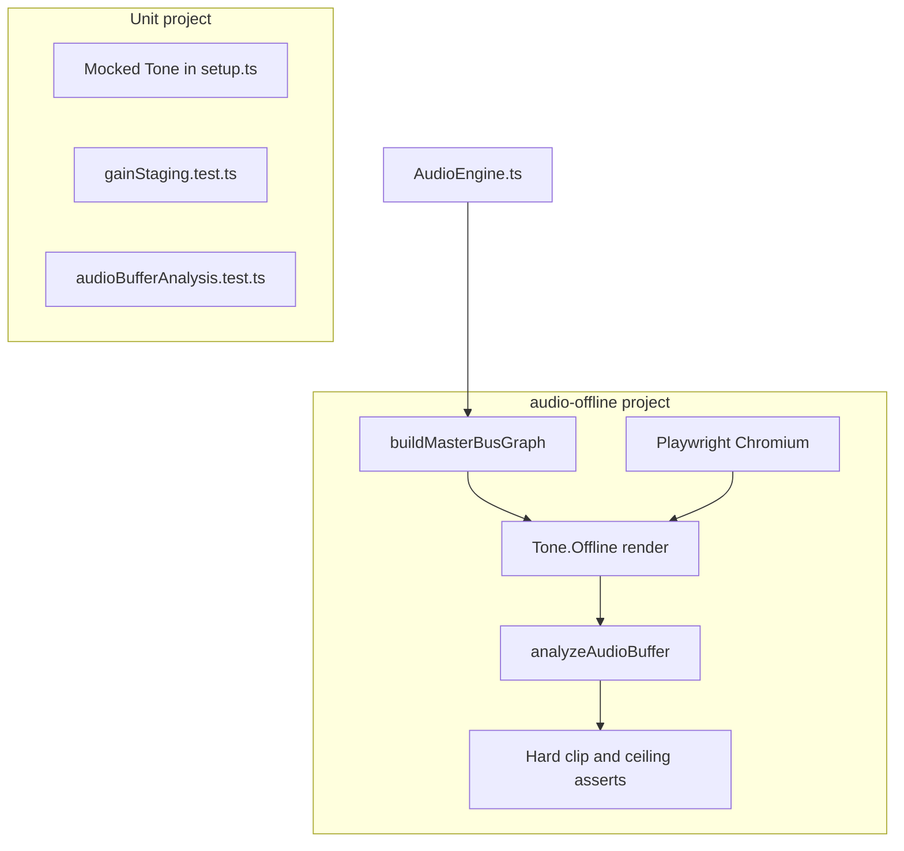

# Gain staging and preset loudness tests

Offline audio renders exercise the real master bus (synth or sampler through
filter, FX, EQ, compressor, makeup, and limiter). Tests measure PCM peaks on
the result so gain staging changes can be validated beyond static dB math.

Unit tests in `gainStaging.test.ts` only check preset math and headroom
estimates. They cannot detect limiter crush, FX buildup, or hot sampler zones
because `src/test/setup.ts` mocks Tone.js and jsdom has no
`OfflineAudioContext`.

## Architecture



Live playback and offline tests share `buildMasterBusGraph()` in
`src/audio/masterBusGraph.ts`. Constants (`BUS_HEADROOM_DB`, FX send
attenuation, harmonic wet trim, etc.) live in `src/audio/busConstants.ts`.

### Why Playwright instead of Node?

`Tone.Offline` needs a real `OfflineAudioContext`. Node polyfills did not work
with Tone.js 15. The `audio-offline` Vitest project runs tests in Playwright
Chromium. The `measure:gain` and `measure:loudness` scripts use the same
browser harness.

Install Chromium once if needed:

```bash
npx playwright install chromium
```

## Vitest projects

Configured in `vite.config.ts`:

| Project | Environment | Includes | Purpose |
|---------|-------------|----------|---------|
| `unit` | jsdom + mocked Tone | `**/*.test.ts` except `*.offline.test.ts` | Fast regression |
| `audio-offline` | Playwright Chromium | `**/*.offline.test.ts` | Real audio renders |

```bash
npm run test:unit    # default npm test
npm run test:audio   # offline renders (~8 s for seven scenarios)
```

Offline tests use a 120 s timeout per case (sampler load + reverb tail).

## Metrics

Implemented in `src/audio/audioBufferAnalysis.ts`:

| Metric | Window | Use |
|--------|--------|-----|
| `peakDb` | Full render | Transient safety |
| `bodyPeakDb` | 0.2 s to 1.0 s | **Preset loudness matching** (chord onset) |
| `bodyRmsDb` | 0.2 s to 1.0 s | Loudness proxy for matching |
| `sustainPeakDb` | 0.8 s to 2.0 s | Gain-staging torture tests |
| `sustainRmsDb` | 0.8 s to 2.0 s | Optional reference |
| `clippedSampleCount` | Full render | Samples with \|x\| >= 0.999 |
| `nearLimiterCount` | Full render | Samples near -3 dB limiter ceiling |

### Targets

| Check | Value | Rationale |
|-------|-------|-----------|
| Limiter ceiling | -3 dBFS | Streaming-safe headroom for AAC inter-sample peaks |
| Offline pass threshold | `sustainPeakDb <= -2.7` | 0.3 dB tolerance under ceiling (`SUSTAIN_PEAK_PASS_DB`) |
| Preset match target | `bodyPeakDb ~= -9` | ~6 dB under limiter; loud on phone without brickwall |
| Match tolerance | +/- 2 dB | Room for category dynamics (`PRESET_LOUDNESS_MATCH_TOLERANCE_DB`) |

`test:audio` asserts **hard limits only**: no clips and sustain peak under the
ceiling. It does not fail on loudness drift between presets.

## npm scripts

Run from `web/`:

```bash
# Seven torture scenarios (warmPad dense voicing, samplers, flat profile)
npm run measure:gain

# Optional: refresh sustain-peak reference JSON (not used by test:audio)
npm run measure:gain -- --write-baseline

# All 22 presets: body/peak/sustain table + suggested volumeDb trims
npm run measure:loudness

# Machine-readable loudness table
npm run measure:loudness -- --json
```

Example `measure:loudness` columns:

- **vol**: current `preset.volumeDb`
- **body**: body peak (matching metric)
- **peak**: full-buffer peak
- **sustain**: sustain-window peak (decay-heavy instruments read low here)
- **trim**: dB to add for -9 body target
- **suggest**: clamped suggested `volumeDb` (-24 to -2)
- **clips**: must stay 0

## Source file map

| File | Role |
|------|------|
| `src/audio/masterBusGraph.ts` | Shared bus builder (live + offline) |
| `src/audio/busConstants.ts` | Shared dB and FX defaults |
| `src/audio/renderGainStagingScenario.ts` | `Tone.Offline` harness |
| `src/audio/gainStagingScenarios.ts` | Seven safety/torture scenarios |
| `src/audio/presetLoudnessScenarios.ts` | One C-major 4-note scenario per preset |
| `src/audio/gainStaging.offline.test.ts` | CI safety asserts |
| `src/audio/audioBufferAnalysis.ts` | PCM metrics |
| `src/audio/measureGainStagingHarness.ts` | Browser entry for CLI scripts |
| `scripts/measure-gain-staging.mts` | Human gain-staging table |
| `scripts/measure-preset-loudness.mts` | Per-preset loudness pass |
| `src/audio/gainStaging.baseline.json` | Optional golden sustain peaks for `measure:gain` |

## Workflow: change master bus or output profiles

1. Edit `outputProfiles.ts`, `busConstants.ts`, or preset `volumeDb` values.
2. Run `npm run measure:gain` and confirm torture scenarios show `ok` and
   clips = 0.
3. Run `npm run test:audio`.
4. Run `npm run measure:loudness` if preset balance may have shifted.
5. Verify on a phone or earbuds (offline metrics do not replace listening).

## Workflow: add a new instrument

### 1. Register the preset

**Tone.js sampler (tonejs-instruments)**

1. Add MP3s under `public/samples/{instrument-id}/`.
2. Regenerate maps: `node scripts/generate-tonejs-instrument-maps.mjs`
3. In `src/audio/samplerPresetProfiles.ts`:
   - Add `KIND_BY_INSTRUMENT_ID` entry (`keyboard`, `string`, `plucked`,
     `woodwind`, `brass`, `mallet`, or `bass`).
   - Add `PRESET_VOLUME_DB[id]` after the first loudness measurement (see
     step 3). Until then the kind profile default (`-8` dB) applies.
4. If the instrument should be hidden, add its id to
   `EXCLUDED_TONEJS_INSTRUMENT_IDS`.

**Custom synth or one-off sampler**

Add a `SynthPreset` entry in `src/audio/synthPresets.ts` with `volumeDb`,
`fxDefaults`, and `envelopeDefaults`.

See `src/audio/PRESET_ATTRIBUTION.md` for sample provenance and download
scripts.

### 2. Add a safety scenario (recommended for hot or unusual presets)

Edit `src/audio/gainStagingScenarios.ts`. Copy an existing block and set:

- `presetId`, `profileId`, `layoutTier`
- `midiNotes` (use a dense or low cluster if the preset is loud)
- `durationSec: 4` and `DEFAULT_SUSTAIN_WINDOW`

`gainStaging.offline.test.ts` picks up new entries automatically via
`GAIN_STAGING_SCENARIOS`.

### 3. Tune loudness

`presetLoudnessScenarios.ts` builds one scenario per entry in `SYNTH_PRESETS`.
New presets are included automatically.

```bash
npm run measure:loudness
```

Find the new row. Adjust `volumeDb` (or `PRESET_VOLUME_DB[id]`) toward
**suggest**, rounded to 0.5 dB. Re-run until **body** is within about +/- 2 dB
of -9 and **clips** is 0.

Typical passes:

1. First trim from `suggest` column.
2. Re-measure and nudge presets still outside the band.
3. Ear-check against warmPad, cello, and trumpet as references.

### 4. Verify

```bash
npm run test:unit
npm run test:audio
npm run measure:loudness
```

## Outlier logic (decaying and percussive instruments)

Not every instrument should match **sustain** peak. That is intentional.

| Category | Body target | Sustain behavior |
|----------|-------------|------------------|
| Pads, brass, strings, organ | ~-9 dBFS body | Sustain near body |
| Grand piano (Salamander) | Boosted toward body | Sustain much lower (natural decay) |
| Xylophone, plucked guitars, harp | Body matched | Sustain -15 to -30 dB (short samples) |

**Grand piano** and **xylophone** sit at the **-2 dB** `volumeDb` floor. Higher
values would chase the 0.2 to 1.0 s body window but squash transients and
push peaks toward the limiter. Accept lower sustain readings for these rows in
`measure:loudness`.

When matching, prioritize **body** and **peak**, not sustain, for:

- `grandPiano`, `piano`, `xylophone`
- `guitar-acoustic`, `guitar-nylon`, `guitar-electric`, `harp`

## Changing limits or targets

| Constant | File | Effect |
|----------|------|--------|
| `LIMITER_CEILING_DB` | `outputProfiles.ts` | Master limiter (-3) |
| `SUSTAIN_PEAK_PASS_DB` | `audioBufferAnalysis.ts` | Offline test ceiling assert |
| `PRESET_LOUDNESS_TARGET_BODY_PEAK_DB` | `audioBufferAnalysis.ts` | `measure:loudness` target (-9) |
| `DEFAULT_BODY_WINDOW` | `audioBufferAnalysis.ts` | Matching window |
| `DEFAULT_SUSTAIN_WINDOW` | `gainStagingScenarios.ts` | Torture test window |

If you change the limiter ceiling, update `SUSTAIN_PEAK_PASS_DB` to
`LIMITER_CEILING_DB + 0.3`.

## Troubleshooting

**`test:audio` fails with timeout**

- Ensure Playwright Chromium is installed.
- First run may be slow while Vite bundles Tone.js for the browser.

**Sampler scenario fails to load**

- Confirm MP3s exist under `public/samples/`.
- `buildMasterBusGraph` awaits `graph.ready` (sampler `onload` + reverb
  `generate()`).

**`measure:loudness` row shows `!` (hot)**

- `peakDb` or `bodyPeakDb` above -2.7, or clips > 0. Lower `volumeDb` or
  reduce makeup/FX in the profile.

**Vitest marks offline tests as slow**

- Expected. Each render takes ~400 to 800 ms. Slow means over Vitest's default
  300 ms threshold, not a failure. Raise `slowTestThreshold` in the
  `audio-offline` project if desired.

**Port 5173 in use**

- Measure scripts auto-pick another port. Safe to ignore.

## Related docs

- [`CONTRIBUTING.md`](../CONTRIBUTING.md): module layout and verification
- [`src/audio/PRESET_ATTRIBUTION.md`](../src/audio/PRESET_ATTRIBUTION.md):
  sample sources and regeneration scripts
- [`README.md`](../README.md): live DSP chain overview
